## Frontend simple challanges

- Visit > [Flappy Plane](https://ugurkarakurt.github.io/Frontend-Challanges/1-Flappy-Plane/)

 

- Visit > [Race Car](https://ugurkarakurt.github.io/Frontend-Challanges/2-Race-Car/index.html)
  
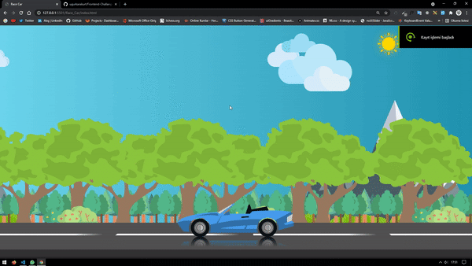

 

- Visit > [Sea Way](https://ugurkarakurt.github.io/Frontend-Challanges/3-Sea-Way/index.html)
  

 

- Visit > [Periodic Table](https://ugurkarakurt.github.io/Frontend-Challanges/4-Periodic-Table/)

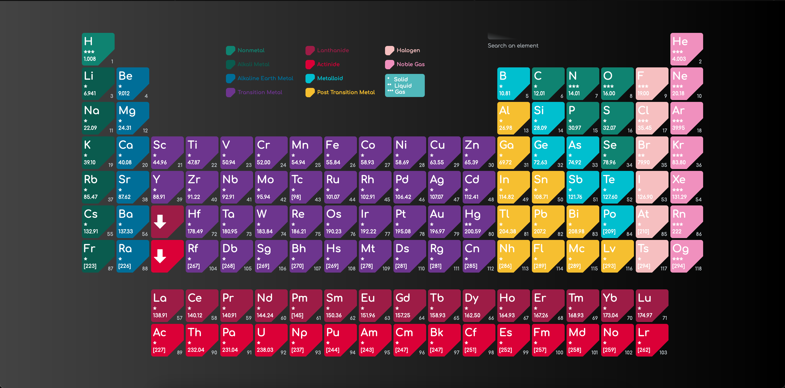

 

- Visit > [Space Way](https://ugurkarakurt.github.io/Frontend-Challanges/5-Space-Way/index.html) 

 

- Visit > [Landing Page](https://ugurkarakurt.github.io/Frontend-Challanges/6-Landing-Page/landing_page.html)
  
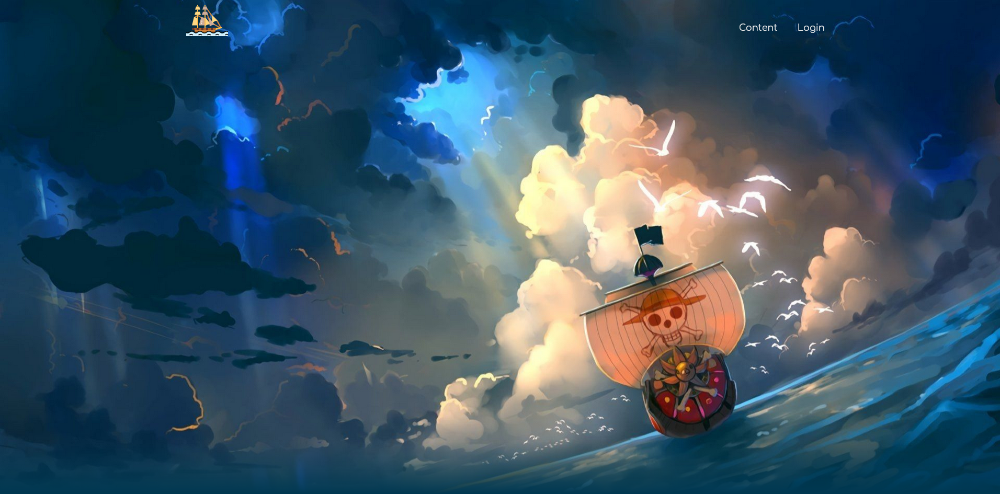

 

- Visit > [Password Generator](https://ugurkarakurt.github.io/Frontend-Challanges/7-Password-Generator/)
  
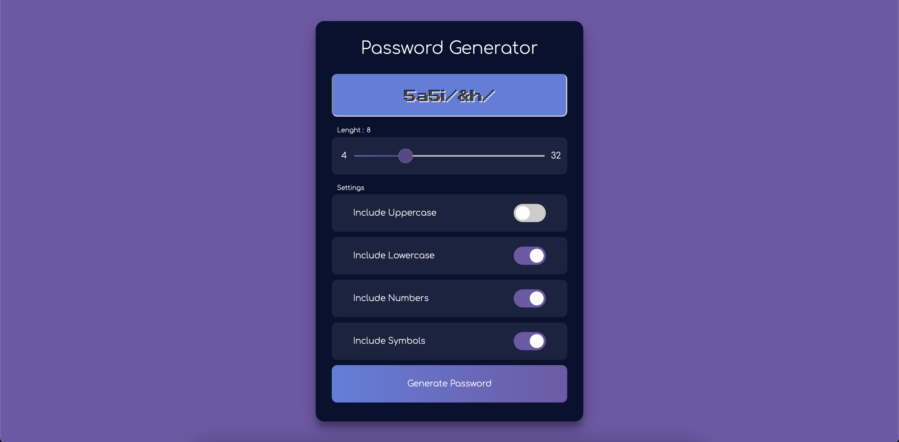

 

- Visit > [Toggle Theme](https://ugurkarakurt.github.io/Frontend-Challanges/8-Toggle-Theme/)
  
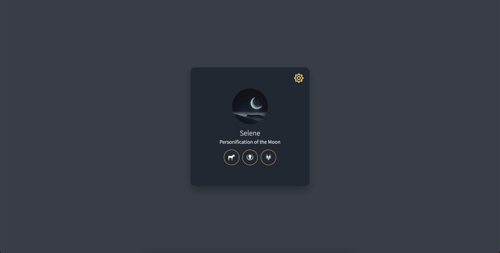

 

- Visit > [Calculator](https://ugurkarakurt.github.io/Frontend-Challanges/9-Calculator/index.html)
  
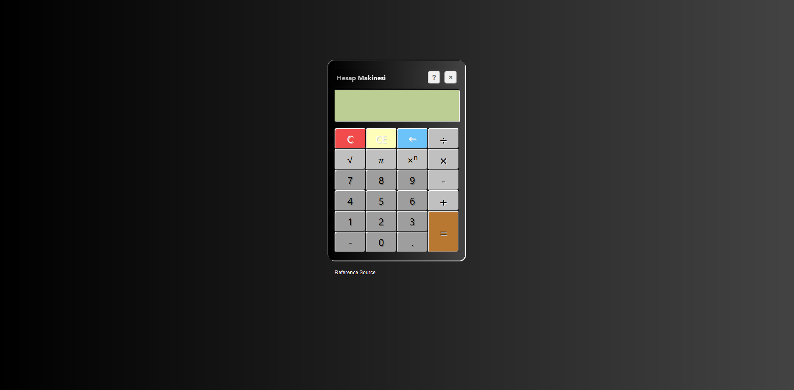

 

- Visit > [Login Register Case](https://ugurkarakurt.github.io/Frontend-Challanges/10-Login-Register-Case/)
  
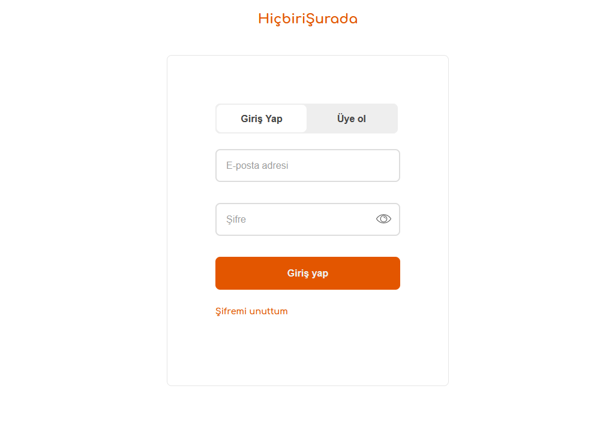

 

- Visit > [Tweet Box](https://ugurkarakurt.github.io/Frontend-Challanges/Twitter_Tweet_Box/)
  
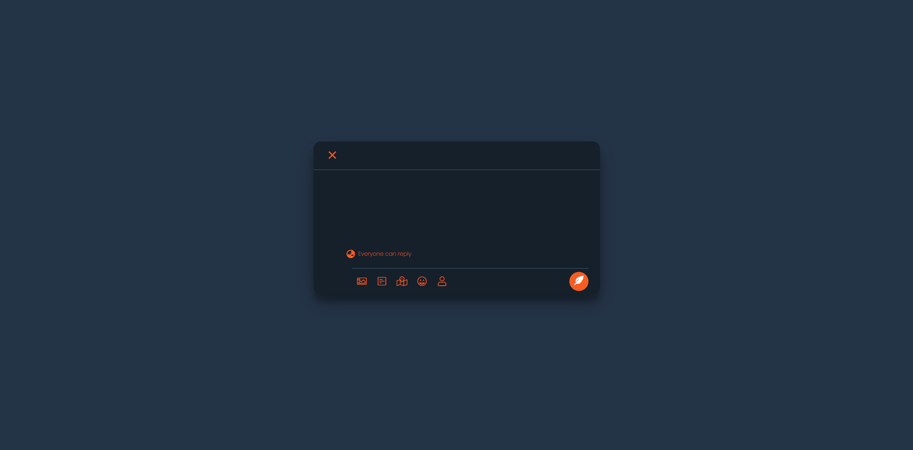

 

- Visit > [Personal Portfolio](https://ugurkarakurt.github.io/Frontend-Challanges/12-Personal-Portfolio/index.html)
  
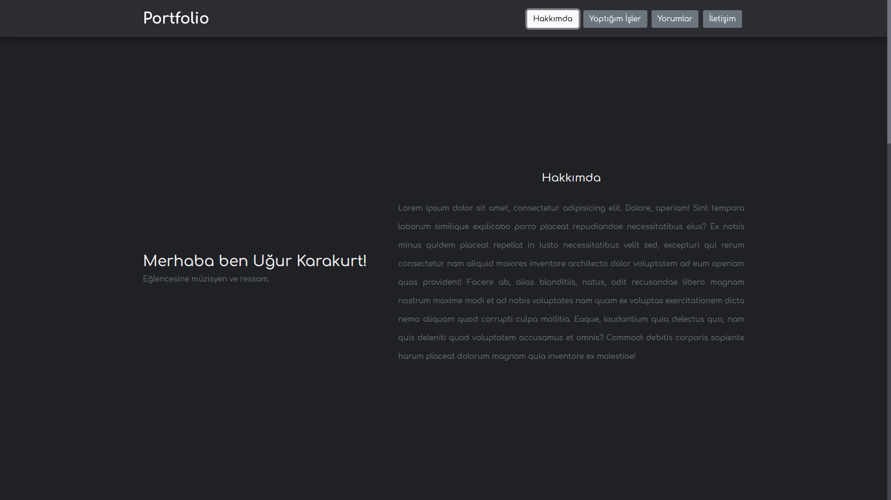

 

- Visit > [Responsive Sidebar](https://ugurkarakurt.github.io/Frontend-Challanges/13-Responsive-Sidebar/index.html)

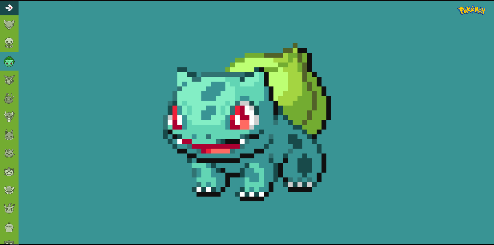

 

- Visit > [Sidebar Menu](https://ugurkarakurt.github.io/Frontend-Challanges/14-Sidebar-Menu/)
  
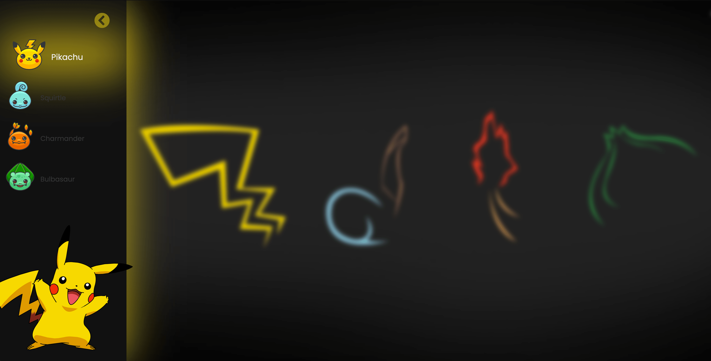

 

- Visit > [Responsive Navbar](https://ugurkarakurt.github.io/Frontend-Challanges/15-Responsive-Navbar/)
  

 

- Visit > [Moonlight Parallax Effect](https://ugurkarakurt.github.io/Frontend-Challanges/16-Moonlight-Parallax-Effect/)
  
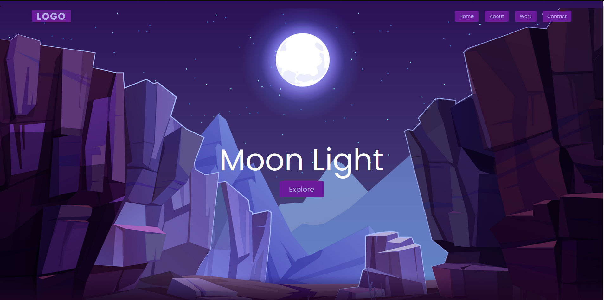

 

- Visit > [Random Cat](https://ugurkarakurt.github.io/Frontend-Challanges/17-Random-Cat/)
  

 

## Features

I will share simple but useful methods under this repository day by day.

